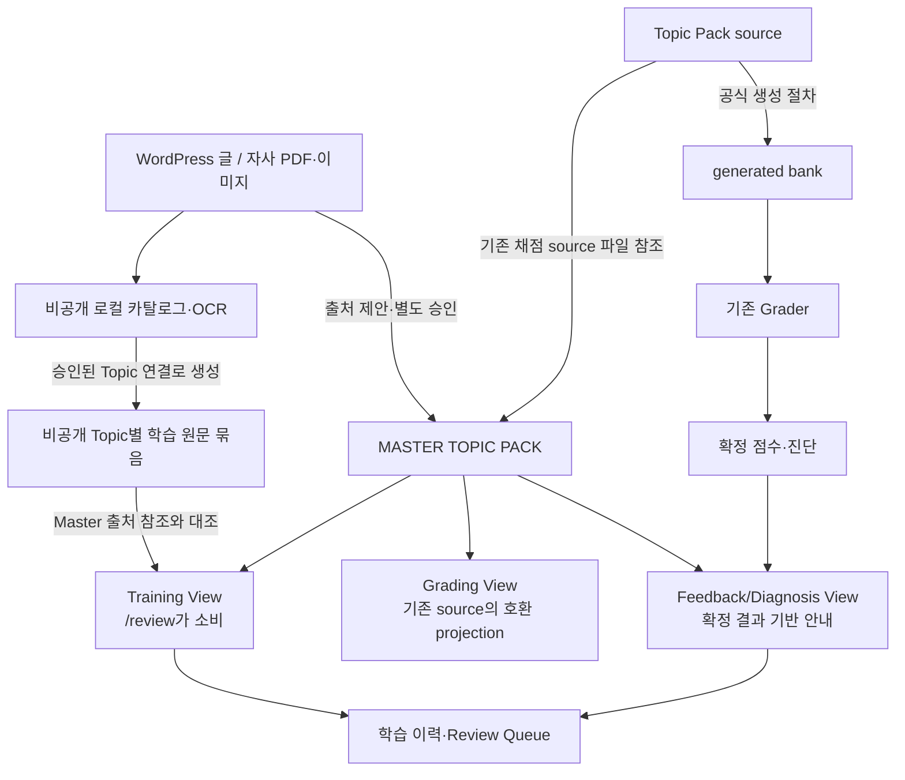

# prof_eng_answer

산업계측제어기술사 논술 답안을 Telegram으로 받아 채점하고, 확정된 결과를 학습·복습에 연결하는 프로젝트입니다. 채점은 기존 A/B/C/D/E 25점 계약과 결정론적 primary 판정이 기준입니다.

## 수험생이 사용하는 명령

| 명령 | 하는 일 |
|---|---|
| `/grade` | 문제와 작성한 답안을 제출해 채점 결과·진단을 받습니다. |
| `/review <topic_id 또는 주제명>` | 원하는 주제를 직접 골라 학습자료와 이전 피드백을 봅니다. |
| `/review done <topic_id>` | 해당 주제의 복습 완료를 기록합니다. |

`/grade`를 입력한 뒤 문제와 답안을 보냅니다.

```text
문제: SIL 결정 방법을 설명하시오.
답안: ...
```

`/review`는 날짜에 따라 자동으로 다른 주제를 선택하지 않습니다. 답안·복습 이력은 Topic Pack과 별도의 사용자 데이터로 저장됩니다.

## 전체 구조



Master는 Topic 식별자·버전·출처와 View 계약을 관리합니다. **운영 Grader는 Grading View가 아닌 generated bank를 읽습니다.** Grading View는 현재 읽기 전용 호환 projection이므로 직접적인 점수 영향이 없습니다. Training과 Feedback/Diagnosis View도 점수·판정을 변경하지 않습니다.

`rubrics/topic_packs/<topic_id>/`는 채점 기준의 canonical source이며, 공식 builder가 `rubrics/generated/` 운영 bank를 만듭니다. WordPress는 별도의 학습 참고자료 경로입니다. WordPress 글·자사 PDF/이미지의 수집 정보와 OCR은 로컬 `data/wordpress_sources.sqlite3`에 저장하고, 승인된 Topic 연결을 기준으로 `scripts/build_wordpress_topic_packs.py`가 `data/wordpress_topic_packs/<topic_id>.json`을 생성합니다. 이 카탈로그와 Topic별 원문 묶음은 비공개 로컬 데이터이며 Git에 포함하지 않습니다.

Master의 `sources[]`는 출처 URL·버전·검증 상태 등 참조를 관리하고, Training View는 이 참조와 비공개 묶음의 Topic/source ID·URL·버전·해시를 대조한 뒤 원문을 학습자료로 노출합니다. Topic 연결 승인, Master 출처 참조 승인은 별도 단계이며, 둘 다 WordPress 내용이 정답 또는 채점 기준으로 승인됐다는 뜻은 아닙니다. WordPress 원문·HTML·OCR·검토 주석은 채점 입력이 아니며, 채점 기준에 반영하려면 별도 내용 검토·승인과 Topic Pack 검증이 필요합니다. 개인 답안, WordPress 원문 DB/OCR 본문, 인증정보는 공개 저장소에 올리지 않습니다.

계층별 실제 소비 경로와 승인 경계는 [시스템 구조](docs/system_architecture.md)에 정리했습니다.

## 사용과 실행

Python 3.11 환경에서 저장소 루트 기준:

```bash
cp .env.example .env
# .env에 필요한 Telegram 및 provider 설정 입력
python3 bot.py
```

Compose 예제를 사용할 때는 `docker-compose.example.yml`을 환경에 맞게 확인하세요. 실제 운영 배포·재시작은 [운영 절차](docs/operation_runbook.md)를 따릅니다. GitHub `main` 병합만으로 운영 서버의 checkout이나 실행 중인 봇이 자동 갱신되는 것은 아닙니다.

## 소스와 검증

| 경로 | 책임 |
|---|---|
| `rubrics/topic_packs/<topic_id>/` | 승인·검증 대상인 canonical 채점용 source |
| `rubrics/generated/` | source로부터 만든 운영 bank 6개; 직접 수정 금지 |
| `master_topic_packs/` | Topic 식별자·참조·세 View의 계약 |
| `data/wordpress_sources.sqlite3` | 비공개 로컬 WordPress 글·출처·추출/OCR 카탈로그 (Git 제외) |
| `data/wordpress_topic_packs/` | 승인된 Topic 연결과 Master 참조를 통해 학습에 쓰는 비공개 Topic별 원문/OCR 묶음 (Git 제외, 채점 입력 아님) |
| `study/` | Training·Diagnosis View, 이력과 Review Queue |
| `grading/`, `grading_agents.py`, `bot.py` | 채점·결과 확정·Telegram 연동 |
| `docs/` | 구조, 작성·승인 절차, 운영 지침 |

현재 커밋의 generated manifest에는 Topic 86개가 있습니다. 이들은 공식 기출문항 목록이 아니라 출제 가능성을 기준으로 구성한 지식 단위입니다. 개수와 내용은 고정된 약속이 아니므로 현재 source와 manifest를 확인하세요.

새 managed Topic은 `rubric_manager.py add-topic`으로 초안을 만들고 사람 검토 후 `rubric_manager.py approve-topic`으로 승인합니다. 기존 Topic 수정도 [작성·승인 절차](docs/topic_pack_workflow.md)를 따르고 생성물을 공식 builder로 갱신합니다. 재생성 결과와 커밋된 bank가 같은지는 작업 트리를 바꾸지 않는 검사로 확인할 수 있습니다.

```bash
python3 -B scripts/check_generated_rubrics_freshness.py
PROMOTE_GENERATED=0 scripts/validate_release.sh
```

CI는 release 회귀, generated 재생성 일치, 작업 트리의 의도치 않은 변경을 검사합니다. 별도 opt-in 재현성 검사와 실제 운영 배포 확인은 이 CI 통과만으로 완료됐다고 간주하지 않습니다.

## 문서 안내

| 알고 싶은 내용 | 문서 |
|---|---|
| 전체 구성·권한 | [시스템 구조](docs/system_architecture.md), [문서 인덱스](docs/README.md) |
| 채점 방식·Topic 자료 | [채점 아키텍처](docs/grading_architecture.md), [Topic Pack 구조](docs/topic_pack_architecture.md) |
| Master·세 View·WordPress 출처와 비공개 원문/OCR 묶음 | [Master/View 계약](docs/master_view_architecture.md), [WordPress/View 계약](docs/wordpress_topic_pack_view_contract.md), [비공개 WordPress OCR Topic Pack](docs/wordpress_topic_pack_ocr.md) |
| 학습·복습 | [학습 계층](docs/learning_layer.md), [Topic 학습 구성 계약](docs/topic_learning_synthesis_contract.md) |
| 개발 진행·남은 일 | [개발 로드맵](docs/development_roadmap.md) |
| 작성·승인·운영 | [Topic Pack 절차](docs/topic_pack_workflow.md), [운영 runbook](docs/operation_runbook.md) |
