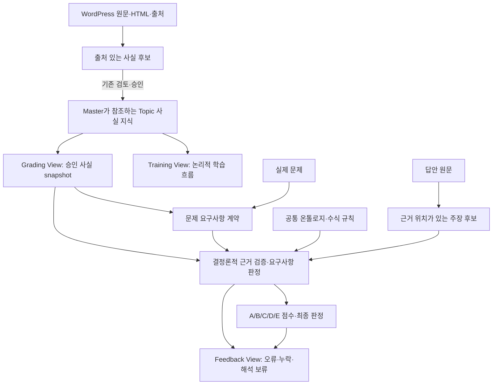

# WordPress 사실 지식 기반 결정론적 채점 보완 계획

작성: 2026-10-10. 상태: 접근 방향·단계별 목표 작성 완료, 구현 단계 미착수.
이 문서는 제안 설계다. 현재 채점 계약은 [채점 구조](grading_architecture.md),
승인·생성 절차는 [Topic Pack workflow](topic_pack_workflow.md)가 소유한다.

## 1. 목표

사용자는 WordPress에서 사실 관계와 적용 조건을 보완한다. 프로그램은 이를 출처가 있는
Topic 지식으로 연결하고, 실제 문제의 요구에 맞춰 수험생이 다양한 표현으로 쓴 답안을
평가한다. 사용자에게 예상문제별 정답 문장·동의어·점수 규칙을 모두 작성하도록 요구하지 않는다.

- WordPress에서 가져오는 지식은 개념, 관계, 수식, 조건, 예외와 근거다.
- 문제별 요구사항과 배점은 별도의 평가 계약으로 관리한다.
- 같은 의미는 같은 사실 근거로 인정한다. 같은 단어도 관계·조건이 다르면 구분한다.
- 지식 부족·문제 해석 실패·답안 해석 실패를 수험생의 오답·누락과 구분한다.
- 점수·fatal·합격은 버전이 고정된 결정론적 평가기가 판정한다.
- 원문은 보존하고 정정·추론·주석은 별도로 남긴다. 기존 승인 기록과 절차를 계승한다.

WordPress 연결은 사실 승인과 별개다. 지식에 적용 조건이나 근거가 부족하면 미확정으로
보존한다. 새로운 공학 관계는 온톨로지 확장 후보로 남기고 기존 관계에 억지로 대응시키지 않는다.

## 2. 현재 기준선과 보완 지점

2026-10-10 코드 기준점 `9ec1c81`: Topic 86개, `machine_contract` 보유 14개.
Golden 감사: 검토 사례 48건, 포함 Topic 31개, 정상·부분·fatal 사례를 모두 가진 Topic 6개.
결정론적 replay: LLM 호출 0회, 48건 모두 점수 산정, fatal 16/16 검출·오탐 0,
반복 일치 100%, 점수 범위 적중 41/48(85.4%). 7건은 모두 기대보다 낮게 평가됐다.
이 수치는 해당 사례 집합의 결과이며 전체 86개 Topic의 정확도를 증명하지 않는다.

재확인 명령:

```bash
python3 -B scripts/audit_golden_risk_coverage.py --top 0
python3 -B scripts/run_deterministic_replay_audit.py --require-ready --output /tmp/deterministic_baseline.json
```

| 실제 구현 | 보완할 점 |
|---|---|
| `canonical_claim_extractor.py`: alias·관계 표현·부정/인용/정정 규칙 | 미등록 표현, 주어 생략, 여러 문장에 걸친 근거의 해석 |
| `fact_anchor_evidence_adapter.py`: 일부 token 일치율로 `SATISFIED` 생성 | 단어 출현과 올바른 관계 설명을 구분 |
| 질문 패턴 유사도·제한된 anchor 검색으로 평가 범위 선택 | 설명·비교·계산·설계 행위와 조건을 구조화 |
| `deterministic_primary_grader.py`: evaluator에 `extraction_complete=True` 전달 | 미해결 문장을 실제 판정 완료 여부에 반영 |
| source 직접 참조와 generated bank 참조 공존 | 한 번의 채점에 사용한 사실·계약·정책 snapshot 통일 |
| Master Grading View는 현재 호환 projection | 아래 목표 구조와 현재 소비 경로를 구분하여 이행 |

저평가 원인은 아직 분해하지 않았다. SIL 오류 답안은 7.61점(기대 10.0~14.5), 같은
fixture의 교정 답안은 직접 실행에서 18.5점·fatal 없음이었다. 나머지 범위 이탈은
SIS/LOPA, MC/DC·V-Model, 진단형 고득점, 적용형 고득점, Nyquist 정상, LQR 정상 사례다.
Stage 5에서 추출 누락·문제 범위·사실 판정·배점·분량 제한을 각각 조사한다.
기대 점수에 맞추기 위한 사례 ID별 예외나 일괄 가산점은 도입하지 않는다.

## 3. 목표 구조



이 도식은 목표다. 초기에는 기존 source·generated를 adapter로 연결한다. 사실 원본은
한 곳에서 관리하고 Master는 참조·버전을 소유한다. 세 View는 같은 사실 ID를 사용하되
학습 순서, 문항 요구, 배점은 각각의 목적에 맞게 관리한다.

| 계층 | 책임 |
|---|---|
| WordPress·출처 카탈로그 | 원문, URL, 절/페이지, 버전·해시, 검토 상태 |
| Topic 사실 지식 | 조건이 붙은 원자 사실, 동등 관계, 명시된 도출 규칙 |
| 공통 온톨로지 | 개념 식별, 단위·차원, 관계 종류와 공통 제약 |
| 문제 요구사항 계약 | 이번 문항의 대상·행위·조건·필수 범위·허용 대안 |
| 답안 해석기 | 원문에 근거한 주장·조건·극성·위치; 점수 판정권 없음 |
| 평가기·점수 정책 | 지식·요구·주장 대조, 오류·충족도·최종 점수 |

## 4. 먼저 확정할 계약

아래 필드는 제안이다. Stage 1에서 schema와 기존 source/anchor ID adapter를 정한 뒤
구현한다. 기존 JSON에 임의로 새 필드를 추가하지 않는다.

### Topic 사실

`fact_id`, `topic_ids`, `statement`, `subject/predicate/object`, `conditions`,
`exceptions`, `quantity/unit`, `source_refs`, `verification_status`, `revision`.
수식에는 기호 정의·단위·가정을 보존한다. 출처가 충돌하면 충돌 상태로 남긴다.
사실 자체에 문항별 배점을 넣지 않는다. 기존 중요도는 호환하되 이번 문제에서 필수인지는
문제 계약이 결정한다. WordPress의 근거와 별도의 도출 결과를 구분한다.

### 문제 요구사항

`question_hash`, `requirement_id`, `question_span`, `task`, `target_concepts`,
`conditions`, `knowledge_refs`, `required/optional`, `alternative_groups`,
`evaluation_policy_ref`, `resolution_status`.

“원리 설명”은 인과관계, “비교”는 비교축별 양쪽 설명, “계산”은 입력·가정·식·결과·단위를
요구한다. 행위별 공통 평가 틀을 기존 Question Type taxonomy 안에서 연결한다.
복합문제는 여러 Topic의 사실을 참조한다. 관련 선수지식도 자동으로 모두 필수화하지 않고
해당 문항의 요구를 충족하는 데 필요한 근거만 명시한다.
모든 요구에 문제 원문 근거나 필수 도출 경로를 남긴다. 문제를 먼저 해석·고정하고 답안을
바꿔도 요구는 유지한다. 지식에서 근거를 찾지 못하면 `knowledge_gap`으로 처리한다.

### 답안 주장·검증 결과

주장은 `claim_id`, `subject/predicate/object`, `conditions`, `polarity`,
`assertion_context`, `source_spans`, `extractor_version`을 가진다.
원문에 없는 내용을 보충하지 않는다. 여러 문장을 결합하면 각각의 위치와 연결 근거를
보존한다. LLM confidence나 원문 위치의 존재만으로 의미 해석이 맞았다고 확정하지 않는다.

검증 결과에는 주장·사실·요구 ID와 지원/충돌/불명확 근거 및 적용 규칙을 기록한다.
다른 object라는 이유만으로 오답 처리하지 않고 대안·배타 관계를 확인한다.
명시된 규칙으로 도출 가능한 동등한 풀이 경로는 원래 모범답안과 달라도 인정한다.

### 미해결 상태·점수

기존 `SATISFIED/PARTIAL/WRONG/MISSING`과 별도로 해석의 `UNRESOLVED` 상태를 보존하는
adapter를 만든다. 새로운 최종 상태는 출력·저장·학습 이력 소비 계약까지 함께 변경한다.

- `MISSING`은 문제 요구가 확정되고 해당 범위의 해석이 충분히 끝났을 때만 가능하다.
- 미해결 요구를 0점 처리하거나 분모에서 제거하여 높은 점수를 만들지 않는다.
- 핵심 요구가 미해결이면 확인된 근거·임시 결과와 `needs_review`를 표시하고 최종 점수·합격
  확정을 보류한다. 검토 후 새 해석 revision으로 재평가하고 이전 결과를 보존한다.
- C는 사실 정확성, B는 요구 범위 충족, D/E는 문제에 필요한 적용·연결 근거를 평가한다.
  같은 오류의 중복 감점을 막으며 구체적 배점은 기존 정책이 소유한다.

## 5. 다양한 표현 처리와 LLM의 역할

기본 parser는 표기·기호·단위·확인된 별칭을 정규화한다. 검색은 후보 사실을 찾는 역할이다.
문장 유사도·embedding 점수만으로 정답을 확정하지 않는다. 수식 동치·단위 변환, 어순,
주어 생략, 부정·인용·정정은 검증 가능한 변환과 원문 근거를 남긴다.

현재 운영 코드에는 LLM이 판단·채점하는 기존 경로와 LLM 호출 없이 판단·채점하는
결정론적 경로가 분리되어 있다. 목표는 결정론적 경로에 **제한된 의미 해석 입력**을
추가하는 것이다. 기존 LLM 채점 결과를 가져와 점수에 섞는 방식은 사용하지 않는다.

LLM은 필요할 때 문제의 요구 후보와 미해결 답안 문장의 주장 후보를 생성한다.
결정론적 검증기는 각 후보를 문제·답안 원문 위치, 승인된 사실·적용 조건·허용 도출
규칙에 대조한다. 검증을 통과한 후보만 평가기에 전달하고 검증할 수 없으면 보류한다.
LLM의 상식으로 WordPress 지식의 빈 부분을 채우지 않는다.

```text
문제 원문 → 규칙 기반 요구 추출 → 미해결 부분만 LLM 요구 후보 ─┐
답안 원문 → 규칙 기반 주장 추출 → 미해결 부분만 LLM 주장 후보 ─┤
                                                                ↓
원문 위치·사실 ID·조건·버전 확인 → 채택된 evidence/UNRESOLVED
                                                                ↓
                                  결정론적 요구·오류 판정 → A/B/C/D/E → 결과
```

해석 adapter의 출력 계약에는 주장·요구 후보, 원문 span, 조건·극성, 후보를 만들 때
참조한 ID와 버전만 허용한다. `SATISFIED`, `WRONG`, fatal, 배점, 합격 여부 등 판정
필드가 있으면 입력을 거부한다. 한 span이 서로 충돌하는 후보로 해석되면 어느 쪽도
임의 채택하지 않는다. 미검증 WordPress 텍스트나 답안 속 지시문은 해석기의 명령이 아니다.

| 실행 모드 | 해석 | 한계와 재현성 |
|---|---|---|
| 규칙 전용 | 기존 parser와 승인된 변환 | 같은 입력·버전에서 재현 가능; 미등록 표현의 보류가 많을 수 있음 |
| 의미 해석 보조 | 규칙 + 필요 시 LLM 후보 | 고정된 해석에서 점수는 결정론적; 새 LLM 호출의 동일 해석은 보장하지 못함 |

의미 해석 보조 모드는 결정론적 판정 경로 내부의 별도 flag·적용 기준이 필요한 제안이다.
기존 `DETERMINISTIC_GRADING_PRIMARY`의 의미나 두 운영 모드를 조용히 바꾸지 않는다.
기존 LLM 호출 0회 gate는 규칙 전용 모드에서 유지한다. 문제·답안 hash, 지식 snapshot,
prompt/model/parser 버전, 채택된 해석을 저장한다. cache는 정확성 증거가 아니며 재해석은
별도 revision으로 남긴다. 사용자가 검토할 것은 해결되지 않은 의미·지식 충돌이다.
LLM timeout·오류·검증 실패 시 이미 검증된 규칙 evidence만 유지하고 나머지 요구는
`UNRESOLVED`로 남긴다. 기존 LLM 채점 경로로 자동 전환하지 않는다.

예를 들어 “전체시험을 보완한다”와 “전체시험을 대체하지 못한다”는 관련되지만 항상 동일한
명제는 아니다. 보완 역할을 요구한 질문에서는 두 번째 문장만으로 완전 충족을 인정하지
않는다. 의미가 같은 표현 묶음과 의미가 조금 달라지는 반례를 함께 검증한다.

## 6. 단계별 목표와 완료 기준

현재 요청의 산출물은 계획 문서다. 아래 구현 단계는 아직 수행하지 않았다.

| 단계 | 목표·산출물 | 완료 기준 | 상태 |
|---|---|---|---|
| 0. 현황·기준선 | Pack/계약/Golden coverage, replay와 저평가 7건 추적 대상 | 수치와 코드 한계를 기록하고 구현 완료와 구분 | 완료: 이 문서 |
| 1. 계약·snapshot | 사실/문제/주장/판정 schema, 기존 ID adapter, 버전·해시·소유권, LLM 후보 입력 허용·금지 필드 | 승인/미승인/충돌 분리, 세 View의 사실 ID 일치, LLM 판정 필드 거부, legacy 호환 확인 | 다음 |
| 2. 사실 projection | 기존 WordPress 카탈로그·claim proposal 재사용, 원자 사실·조건·출처 연결 | 대표 3개 Topic에서 문항별 정답 추가 없이 사실 갱신; 출처 변경 영향 추적 | 대기 |
| 3. 문제 요구 compiler | 행위·대상·조건·비교축·복합 Topic·허용 대안 | 같은 Topic의 다른 질문·미등록 질문 구분, 답안 변경에도 요구 불변, 지식 부족 보류 | 대기 |
| 4. 주장 해석·보류 전파 | parser 보강, 미해결 부분의 LLM 요구/주장 후보 adapter, 원문 검증, 추출 완료·출력·저장 연결 | 후보의 원문 근거·부정·조건·정정 확인, 판정 필드 거부, 실패 시 `UNRESOLVED` 유지 | 대기 |
| 5. 판정·점수 연결 | 채택된 evidence만 관계·조건·도출 검증, B/C/D/E 귀속, 저평가 7건 원인별 개선 | LLM 후보를 바꿔도 같은 채택 evidence에는 같은 점수, 단어 나열 오인정 방지, fatal/판정권 gate 통과 | 대기 |
| 6. 독립 평가·shadow | 대표 3개 Topic에서 규칙 전용·의미 해석 보조·기존 LLM 채점 경로를 동일 문항으로 비교 | 아래 기준 충족, 후보 채택/거절과 보류율·비용·지연 보고, 운영 점수 적용 전 비교 완료 | 대기 |
| 7. Topic별 확대 | 3 → 10 → 전체 86개 순으로 사실·요구·표현 coverage 확대 | Topic별 활성화 근거 확보, 미검증 Topic은 보류/기존 모드 상태 표시 | 대기 |
| 8. release·운영 | 문서·generated 일치, 결정론적 경로 내 해석 보조 flag, 출력·이력·배포·복구 경로 | 전체 regression/release/CI PASS, 기존 두 모드 호환, 보조 해석 실패 시 자동 legacy 판정 금지, 운영 provenance·결과 확인 | 대기 |

대표 후보: SIL 목표 결정(수식·차원), V-Model(비교·생명주기), Nyquist(조건·해석).
Stage 1에서 비공개 출처 가용성을 확인한다. 자료가 부족하면 승인된 같은 유형의 Topic으로
교체하고 이유를 기록한다. 이 문서의 Stage 0~8은 과거 전환 Stage35~58과 구분한다.

## 7. 평가·활성화 기준

Stage 1에서 dataset과 기준을 버전으로 고정한다. 아래는 초기 제안 기준이며 기존 gate를
대체하지 않는다. 검증 결과를 본 뒤 통과하도록 기준을 낮추지 않는다.

- 개발용/독립 검토용은 문제·표현 묶음 단위로 분리한다. 같은 원문의 바꿔 쓰기를 양쪽에
  나누지 않는다. 기존 48건은 회귀 자료로 유지하고 미검증 문항을 별도로 확보한다.
- Topic별 적용 가능한 원리·비교·설계·계산 요구를 포함한다. 동일 개수의 사례를 강제하지
  않지만 활성화 범위의 누락은 명시한다.
- 의미·조건이 같은 표현은 B/C 사실 판정이 일치해야 한다. A 구조와 D/E 근거까지 통제한
  쌍에서 전체 점수 일치를 확인한다.
- 관계 반전·조건 누락·단위 오류·부정·인용·정정, 여러 정답 경로, 미등록 사실을 검사한다.
  같은 단어의 오답과 다른 표현의 정답을 모두 포함한다.
- 독립 검토 묶음에서 알려진 fatal 누락·fatal 오탐·오합격 0건, 정확히 동등한 주장 판정
  일치 100%, 고정된 해석 snapshot 재실행 일치 100%를 목표로 한다.
- 확정 점수의 전문가 범위 적중 목표는 95% 이상이며 기존 48건 결과도 악화되지 않아야
  한다. 과대/과소평가를 각각 보고하고 저평가 7건의 원인·처리 결과를 기록한다.
- 전체 입력 수, 확정 채점률, 보류율, 지식 부족률, 해석 오류율을 함께 보고한다.
  점수 적중률은 확정 건 기준과 전체 건 기준을 모두 제시한다. 최소 확정 채점률은 Topic별
  baseline·제공 범위를 근거로 사전 확정하여 무조건 보류로 정확도를 높이는 것을 방지한다.
- 의미 해석 보조 모드는 새 해석의 변동·호출 비용·시간·실패를 별도 평가한다. 후보가 달라도
  무조건 같은 점수를 강제하지 않고 해석 변경과 점수 영향을 추적한다.
- 별도 권한 테스트로 LLM 후보에 점수·fatal·합격 필드를 넣어도 판정이 바뀌지 않음을
  확인한다. 같은 검증된 evidence의 점수는 규칙 전용과 해석 보조 모드에서 같아야 한다.
  LLM이 실패하거나 오염된 원문 지시문을 받아도 자동으로 기존 LLM 판정 경로에 넘기지 않는다.

채점 코드·룰브릭 변경 단계에서는 `AGENTS.md`와 workflow에 따른 focused/Golden,
`python3 scripts/rubric_manager.py validate-all`, `PROMOTE_GENERATED=0 scripts/validate_release.sh`,
generated 재생성 일치 검사를 수행한다. source는 기존 승인·hash 계약을 따르며 generated는
공식 CLI로만 생성한다. 전체 gate를 통과해도 독립 정확도 기준을 충족하지 못한 Topic은
새 경로로 활성화하지 않는다.

## 8. 작업 기록과 다음 단계

각 Stage에 입력 revision, 변경 파일, 실제 검증 수치, 미해결 사항과 다음 단계를 기록한다.
원문·답안·운영 DB·해석 전문은 비공개로 보관하고 공개 저장소에는 계약·코드·공개 가능한
검증 집계만 둔다. 단계별 PASS 후 commit하고 push와 배포는 별도로 기록한다.

현재 위치: Stage 0 완료. 다음 작업: Stage 1의 네 계약 초안, 기존 ID adapter와 snapshot
경계 설계. 전체 Pack 내용 변경과 채점 방식 전환은 이후 단계에서 수행한다.
